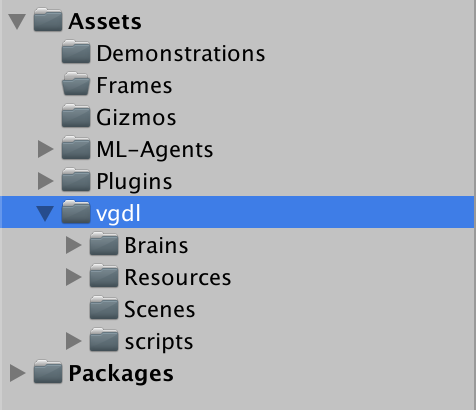

# UnityVGDL

A Video Game Description Language (VGDL) Implementation in Unity of the GVGAI VGDL ontology (https://github.com/GAIGResearch/GVGAI)

## Citation

If you use UnityVGDL to conduct research, we ask that you cite the following paper as a reference:
Mads Johansen, Martin Pichlmair and Sebastian Risi (2019). Video Game Description Language Environment for Unity Machine Learning Agents. In: Proceedings of the IEEE Conference on Games (CoG) 2019. http://ieee-cog.org/papers/paper_209.pdf. https://github.com/pyjamads/UnityVGDL.

## Contribution

[Contribution guidelines for this project](docs/CONTRIBUTING.md)

## Installation 

1. Download Unity 2018.x from https://store.unity.com/download or through UnityHub.

2. Download and follow setup instructions for the [ML-Agents framework](https://github.com/Unity-Technologies/ml-agents/blob/master/docs/Readme.md) https://github.com/Unity-Technologies/ml-agents

3. Get UnityVGDL
  * Download the UnityVGDL files, and put them inside the UnitySDK/Assets folder in your ml-agents folder.
  * Alternatively you can setup UnityVGDL as a [sub-module](https://git-scm.com/book/en/v2/Git-Tools-Submodules) in your personal fork of ML-Agents. https://github.blog/2016-02-01-working-with-submodules/

###### Project Outline

4. Run Unity and open the UnitySDK project.

5. Open one of the Scenes from the vgdl/Scenes folder.

## Usage

[Documentation for using the UnityVGDL framework](docs/USAGE.md)
